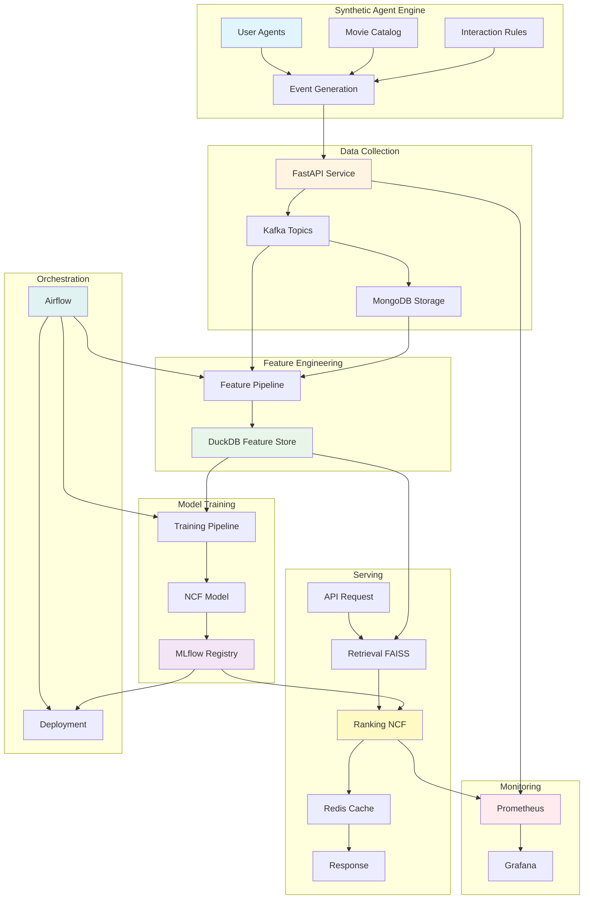
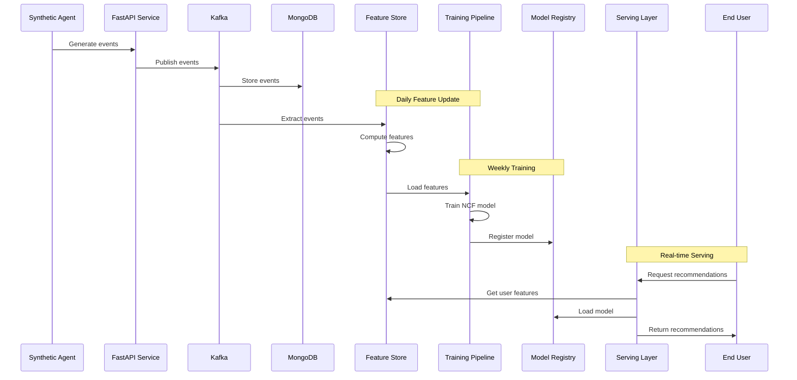

# AgentBricks Architecture Overview

AgentBricks is a story-driven learning platform that teaches ML system design through hands-on building. This document provides a high-level overview of the system architecture, components, and design decisions.

## System Components

### 1. Synthetic Agent Engine

**Purpose**: Generate realistic user behavior for millions of synthetic users without privacy concerns.

**Components**:
- **User Agents**: Simulated users with preferences, demographics, and behavioral patterns
- **Movie Items**: Catalog of movies with metadata (genres, ratings, release dates)
- **Interaction Rules**: Probabilistic rules governing user behavior (views, ratings, searches, skips)

**Output**: Event streams simulating millions of users interacting with the platform

**Location**: `sim/`

**Key Features**:
- Reproducible data generation (seeded randomness)
- Configurable user populations
- Realistic temporal patterns
- Batch and streaming generation modes

### 2. Data Collection Layer

**Purpose**: Ingest and validate user interaction events in real-time.

**Components**:
- **FastAPI Service**: RESTful API for event ingestion
- **Kafka**: Event streaming platform for decoupled data flow
- **MongoDB**: Event storage for replay and debugging

**Flow**: Client → API → Kafka → Storage

**Location**: `stories/movie-recommender/brick-01-data-collection/`

**Key Features**:
- Schema validation with Pydantic
- Event deduplication
- Request/response logging
- Health checks and metrics

### 3. Feature Engineering Layer

**Purpose**: Transform raw events into ML-ready features with point-in-time correctness.

**Components**:
- **Feature Pipeline**: Batch and real-time feature computation
- **Feature Store (DuckDB)**: SQL-based feature storage with temporal queries
- **Feature Registry**: Versioning and metadata management

**Output**:
- User features (watch time, favorite genres, activity patterns)
- Movie features (popularity, ratings, metadata)
- Interaction features (temporal patterns, sequences)

**Location**: `stories/movie-recommender/brick-02-feature-engineering/`

**Key Features**:
- Point-in-time correctness (no data leakage)
- Incremental feature updates
- Feature versioning
- SQL interface for feature queries

### 4. Model Training Layer

**Purpose**: Train and evaluate recommendation models using historical data.

**Components**:
- **NCF Model**: Neural Collaborative Filtering architecture (PyTorch)
- **Training Pipeline**: Data loading, negative sampling, training loop
- **MLflow Registry**: Model versioning, experiment tracking, metrics storage

**Output**: Trained models with evaluation metrics (AUC, NDCG, Hit Rate)

**Location**: `stories/movie-recommender/brick-03-model-training/`

**Key Features**:
- Reproducible training (seeds, configs)
- Early stopping
- Model checkpointing
- Experiment tracking
- Hyperparameter tuning support

### 5. Serving Layer

**Purpose**: Generate real-time recommendations with low latency.

**Components**:
- **Retrieval Stage (FAISS)**: Fast vector search for candidate generation
- **Ranking Stage (NCF)**: Neural network scoring for final ranking
- **Caching (Redis)**: Response caching and feature caching
- **Fallback Strategies**: Popular items, geographic recommendations

**SLA**: <100ms P95 latency

**Location**: `stories/movie-recommender/brick-04-recommendation-service/`

**Key Features**:
- Two-stage retrieval + ranking architecture
- Cold-start handling
- Request batching
- Graceful degradation

### 6. Monitoring Layer

**Purpose**: Observe system health, performance, and model quality.

**Components**:
- **Prometheus**: Metrics collection and storage
- **Grafana**: Visualization and dashboards
- **Alerting**: Rule-based notifications for anomalies

**Metrics**:
- **Latency**: P50, P95, P99 response times
- **Throughput**: Requests per second
- **Errors**: Error rates by type
- **Model Scores**: Prediction distributions, calibration
- **Business Metrics**: Click-through rates, engagement

**Location**: `stories/movie-recommender/brick-05-monitoring/`

**Key Features**:
- Real-time dashboards
- Custom ML metrics
- Alert rules
- Log aggregation

### 7. Orchestration Layer

**Purpose**: Automate end-to-end ML pipeline execution.

**Components**:
- **Airflow DAGs**: Workflow definitions
- **Task Orchestration**: Dependency management, retries, SLAs
- **Scheduling**: Time-based and event-based triggers

**Schedule**:
- **Daily**: Feature updates, data generation
- **Weekly**: Model retraining, evaluation, deployment
- **On-Demand**: Manual triggers for experiments

**Location**: `stories/movie-recommender/brick-06-orchestration/`

**Key Features**:
- Conditional logic (deploy only if metrics pass)
- Retry mechanisms
- SLA monitoring
- Notifications (Slack, email)

## Data Flow Diagram

## End-to-End Pipeline Flow

## Technology Stack

### Core Languages
- **Python 3.11+**: Primary language for all components
- **SQL**: Feature store queries and analytics

### Data Infrastructure
- **Kafka**: Event streaming (decoupling, replay, high throughput)
- **MongoDB**: Event storage (flexible schema, time-series data)
- **DuckDB**: Feature store (embedded, SQL interface, point-in-time queries)
- **Redis**: Caching (low latency, high throughput)
- **PostgreSQL**: Metadata storage (ACID compliance, relational queries)

### Machine Learning
- **PyTorch**: Deep learning framework (NCF model, flexibility)
- **scikit-learn**: Preprocessing and utilities
- **FAISS**: Vector similarity search (fast retrieval)
- **MLflow**: Model registry and experiment tracking

### API & Serving
- **FastAPI**: Modern async Python framework
- **Uvicorn**: ASGI server
- **Pydantic v2**: Data validation

### Orchestration
- **Apache Airflow**: Workflow orchestration (mature, extensible)
- **Prefect**: Alternative orchestration option

### Monitoring
- **Prometheus**: Metrics collection
- **Grafana**: Visualization

### Development & Testing
- **pytest**: Testing framework
- **Black**: Code formatting
- **Ruff**: Fast Python linter
- **mypy**: Static type checking

### Infrastructure
- **Docker**: Containerization
- **Docker Compose**: Local development
- **Terraform**: Infrastructure as Code
- **Kubernetes**: Production orchestration (optional)

## Design Decisions

### 1. Why Synthetic Data?

**Decision**: Use synthetic agents instead of real user data.

**Rationale**:
- **Privacy**: No privacy concerns or GDPR compliance needed
- **Scale**: Generate millions of users instantly
- **Reproducibility**: Seeded randomness enables reproducible experiments
- **Control**: Full control over data distributions and edge cases
- **Education**: Safe environment for learning without real-world consequences

**Trade-offs**:
- ✅ No privacy concerns
- ✅ Unlimited scale
- ✅ Reproducible
- ❌ May not capture all real-world edge cases
- ❌ Requires careful design to be realistic

### 2. Why Kafka for Event Streaming?

**Decision**: Use Kafka instead of direct database writes or message queues.

**Rationale**:
- **Decoupling**: Producers and consumers are independent
- **Durability**: Events are persisted and replayable
- **Throughput**: Handles millions of events per second
- **Industry Standard**: Widely used in production ML systems
- **Replay**: Can reprocess historical events for feature engineering

**Trade-offs**:
- ✅ High throughput and durability
- ✅ Decoupled architecture
- ✅ Event replay capability
- ❌ Additional infrastructure complexity
- ❌ Learning curve for beginners

### 3. Why DuckDB for Feature Store?

**Decision**: Use DuckDB instead of Redis, PostgreSQL, or specialized feature stores.

**Rationale**:
- **Embedded**: No separate server process needed
- **SQL Interface**: Familiar to most developers
- **Point-in-Time Queries**: Built-in support for temporal correctness
- **Performance**: Fast analytical queries
- **Simplicity**: Easy to set up and use for learning

**Trade-offs**:
- ✅ Simple setup (embedded)
- ✅ SQL interface (familiar)
- ✅ Good for learning
- ❌ Not as scalable as distributed feature stores
- ❌ Limited real-time capabilities

### 4. Why Two-Stage Retrieval + Ranking?

**Decision**: Separate retrieval (FAISS) and ranking (NCF) stages.

**Rationale**:
- **Latency**: Fast retrieval narrows candidate set quickly
- **Accuracy**: Ranking stage uses full model for precision
- **Scalability**: Can retrieve from millions of items efficiently
- **Flexibility**: Can swap retrieval or ranking strategies independently
- **Industry Standard**: Used by Netflix, Amazon, etc.

**Trade-offs**:
- ✅ Low latency (<100ms)
- ✅ Handles large catalogs
- ✅ Flexible architecture
- ❌ More complex than single-stage
- ❌ Requires tuning both stages

### 5. Why Airflow for Orchestration?

**Decision**: Use Airflow instead of Prefect, Luigi, or custom scripts.

**Rationale**:
- **Mature**: Battle-tested in production
- **Rich Ecosystem**: Many integrations and operators
- **UI**: Built-in web UI for monitoring
- **Scheduling**: Flexible scheduling and dependency management
- **Industry Standard**: Widely adopted in ML teams

**Trade-offs**:
- ✅ Mature and stable
- ✅ Rich feature set
- ✅ Good UI
- ❌ Can be heavy for simple workflows
- ❌ Requires infrastructure setup

### 6. Why FastAPI for APIs?

**Decision**: Use FastAPI instead of Flask, Django, or gRPC.

**Rationale**:
- **Performance**: Fast async framework
- **Type Safety**: Built-in Pydantic validation
- **Documentation**: Automatic OpenAPI docs
- **Modern**: Async/await support
- **Developer Experience**: Great tooling and IDE support

**Trade-offs**:
- ✅ High performance
- ✅ Automatic validation
- ✅ Great docs
- ❌ Async complexity for beginners
- ❌ Newer than Flask/Django

### 7. Why NCF for Recommendations?

**Decision**: Use Neural Collaborative Filtering instead of simpler matrix factorization.

**Rationale**:
- **State-of-the-Art**: Modern deep learning approach
- **Flexibility**: Can incorporate side features
- **Learning Value**: Teaches neural network architectures
- **Production-Ready**: Used in real systems
- **Balance**: More complex than MF, simpler than transformer models

**Trade-offs**:
- ✅ Modern approach
- ✅ Good learning value
- ✅ Production-relevant
- ❌ More complex than basic MF
- ❌ Requires GPU for large-scale training

## Scalability Considerations

### Current Design (Learning Focus)
- **Users**: Millions (synthetic)
- **Items**: Thousands (movies)
- **Throughput**: 100-500 req/sec per instance
- **Latency**: <100ms P95

### Production Scaling Path
- **Horizontal Scaling**: Add more serving instances
- **Caching**: Redis for hot data
- **Database Sharding**: Partition by user/item
- **CDN**: Static content delivery
- **Load Balancing**: Distribute traffic
- **Feature Store**: Migrate to distributed store (Feast, Tecton)
- **Model Serving**: Use specialized serving (TorchServe, TensorFlow Serving)

## Security Considerations

- **No Real User Data**: Synthetic data eliminates privacy risks
- **Input Validation**: Pydantic schemas validate all inputs
- **Rate Limiting**: Should be added for production
- **Authentication**: Not implemented (learning focus)
- **Secrets Management**: Environment variables for sensitive data
- **Container Security**: Non-root users in Docker images

## Future Enhancements

- **Multi-Arc Support**: Additional story arcs (TikTok, Amazon, etc.)
- **Real-Time Features**: Stream processing for real-time features
- **A/B Testing**: Framework for experimentation
- **Feature Store Upgrade**: Distributed feature store
- **Model Serving**: Specialized serving infrastructure
- **Multi-Region**: Geographic distribution
- **Advanced Models**: Transformer-based recommendations

## References

- [Neural Collaborative Filtering Paper](https://arxiv.org/abs/1708.05031)
- [Feature Store Best Practices](https://www.featurestore.org/)
- [ML System Design Patterns](https://www.oreilly.com/library/view/designing-machine-learning/9781492047956/)
- [Production ML Systems](https://www.oreilly.com/library/view/building-machine-learning/9781492045106/)

---

**Last Updated**: 2025
**Version**: 0.1.0
**Maintainer**: AgentBricks Team
